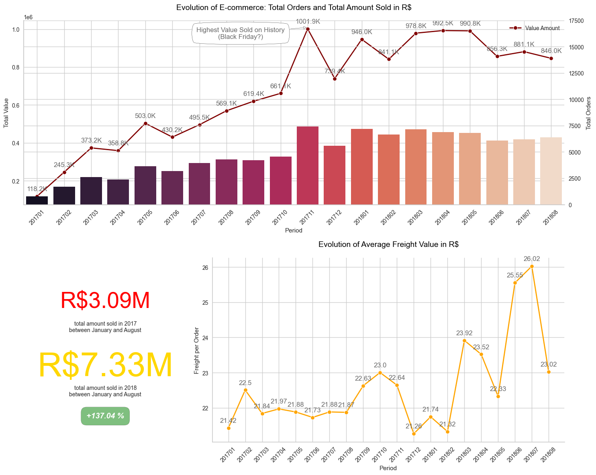

# Brazilian E-Commerce Public Dataset by Olist
This Documentation presented by Gamma Team:

Mario Billy Gunawan  
Muhammad Reyhan  
Muhamad Rafif  
## Business Understanding  
### Introduction  
Olist, a Brazilian e-commerce marketplace integrator, is an online e-commerce site aggregation platform designed to facilitate direct sales on e-commerce sites of Brazil. The company's platform connects entrepreneurs with major online retailers and allows shopkeepers to advertise and sell in the marketplaces without complication, enabling retail companies to reach out to the international marketplaces, improve the shopping experience and modify their purchasing behavior. Olist connects small businesses from all over Brazil to channels without hassle and with a single contract. Those merchants are able to sell their products through the Olist Store and ship them directly to the customers using Olist logistics partners. After a customer purchases the product from Olist Store a seller gets notified to fulfill that order. Once the customer receives the product, or the estimated delivery date is due, the customer gets a satisfaction survey by email where he can give a note for the purchase experience and write down some comments.  

### Context
The dataset has information of 100k orders from 2016 to 2018 made at multiple marketplaces in Brazil. Its features allows viewing an order from multiple dimensions: from order status, price, payment and freight performance to customer location, product attributes and finally reviews written by customers.The geolocation dataset that relates Brazilian zip codes to lat/lng coordinates.  

### Problem Statements
Olist have collected data throughout the year, the data contains seperated information, there are aggregated data, unique data or even combination of both (Aggregated on a unique data). With olist current dataset, it is hard to identify customer behaviour, since it has no representation of customer segments, moreover, even after understanding with segmentation what kind of approach should they take? hence... The questions to be answered in this project:

1. Is there any growing trend on e-commerce sales in Brazil?  
2. How the total sales is concentraded in brazilian states?  
3. What are the best states to do transaction in Brazil?  
4. How payments types can take influence on e-commerce?  
5. How are the behaviour of our customer?  
6. How would you classify them?  
7. How CRM campaign strategy be implemented?  

### Objective
With this project, it is hoped that Olist will be able to classify their customers with the appropriate segmentation.

### Project Limitation
The machine learning model built is limited to orders from 2016 to 2018 made at multiple marketplaces in Brazil from the Brazilian E-Commerce Public Dataset by Olist. So the performance of the model will be much different when used to classify customers from today. #In addition, this model is built from several selected features based on features importance and correlation analysis to the target.

### Analytical Approach
Underlying the problem statements, Our main focus lies around the implementation of CRM Campaign, the analytical approach we use are:

1. Customer Segmentation by Clustering  
2. Classification of Clusters  

### Evaluation Metrics
Since dealing with multi-class classification, False Classes are equally important, hence F1-Score would be an appropriate metrics for this.  

## Data Understanding  
  
Dataset Resource: https://www.kaggle.com/datasets/olistbr/brazilian-ecommerce?select=olist_order_items_dataset.csv

Features Description:

- order_id : unique identifier of the order.
- order_item_id : sequential number identifying number of items included in the same order.
- product_id : product unique identifier.
- seller_id : seller unique identifier.
- shipping_limit_date : Shows the seller shipping limit date for handling the order over to the logistic partner.
- price : item price.
- freight_value : item freight value item (if an order has more than one item the freight value is splitted between items).
- customer_id : key to the orders dataset. Each order has a unique customer_id.
- order_status : Reference to the order status (delivered, shipped, etc).
- order_purchase_timestamp : Shows the purchase timestamp.
- order_approved_at : Shows the payment approval timestamp.
- order_delivered_carrier_date : Shows the order posting timestamp. When it was handled to the logistic partner.
- order_delivered_customer_date : Shows the actual order delivery date to the customer.
- order_estimated_delivery_date : Shows the estimated delivery date that was informed to customer at the purchase moment.
- payment_sequential : a customer may pay an order with more than one payment method. If he does so, a sequence will be created to accommodate all payments.
- payment_type : method of payment chosen by the customer.
- payment_installments : number of installments chosen by the customer.
- payment_value : transaction value.
- review_id : unique review identifier.
- review_score : Note ranging from 1 to 5 given by the customer on a satisfaction survey.
- review_comment_title : Comment title from the review left by the customer, in Portuguese.
- review_comment_message : Comment message from the review left by the customer, in Portuguese.
- review_creation_date : Shows the date in which the satisfaction survey was sent to the customer.
- review_answer_timestamp : Shows satisfaction survey answer timestamp.
- product_category_name : root category of product, in Portuguese.
- product_name_lenght : number of characters extracted from the product name.
- product_description_lenght : number of characters extracted from the product description.
- product_photos_qty : number of product published photos.
- product_weight_g : product weight measured in grams.
- product_length_cm : product length measured in centimeters.
- product_height_cm : product height measured in centimeters.
- product_width_cm : product width measured in centimeters.
- customer_unique_id : unique identifier of a customer.
- customer_zip_code_prefix : first five digits of customer zip code.
- customer_city : customer city name.
- customer_state : customer state initials.
- geolocation_lat_x : customer latitude.
- geolocation_lng_x : customer longitude.
- seller_zip_code_prefix : first five digits of seller zip code.
- seller_city : seller city name.
- seller_state : seller state initials.
- geolocation_lat_y : seller latitude.
- geolocation_lng_y : seller longitude.
- product_category_name_english : category name in English.

## Exploratory Data Analysis  

### Evolution of Total Orders in Brazilian E-Commerce
  

### Total Orders Comparison Between 2017 and 2018 (January to August)
  

### Evolution of E-Commerce Orders on Brazilian Regions
  

### Evolution of E-commerce: Total Orders and Total Amount Sold in R$
  

### Comparative Study: E-Commerce Delivery Performance
  

### Evolution of Payment Types in Brazilian E-Commerce
  

